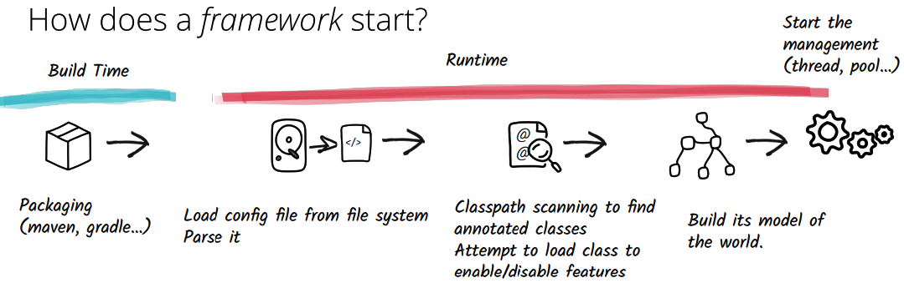
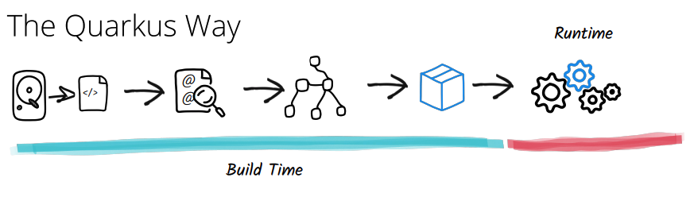

# QuarkBox 🚀 🏂 ⚡️

This project is just a Playground for Quarkus exploration, so don't expect coherence in code 😄. It includes code for different ideas, flows, context/domain in order to tesy quickly different features of Quarkus stack.

The project uses [Quarkus](https://quarkus.io/), a Java Framework with the ability to create native images (binary and platform-specific executables). For reactive programming support it uses [Smallrye](https://smallrye.io/). The architecture follows the [MicroProfile](https://projects.eclipse.org/projects/technology.microprofile) specification for building microservices and deliver portable applications across multiple runtimes.

 

### Requirements:

- Java 11
- Gradle 7
- GraalVM 21
- Docker


## How Quarkus works

Quarkus adopts the container first approach. This approach is optimized for low memory usage and fast startup times in areas like build time metadata processing and reduction in reflection usage.

Normal frameworks use build time for packaging only, and most work is given for runtime processing, such as classpath scanning. Every time the application is restarted, all the steps are done again, increasing start and loading time.



Quarkus transfers these steps to build time by using its extensions. There are extensions for many Java frameworks, such as RESTeasy, Hibernate, database drivers, and also spring features. These extensions help on loading only what is needed and avoiding unnecessary classes, methods, and lines of code that are never reached. All the work is done once, not at each start, and not all the bootstrap classes are loaded.




## Features:

- Rest client
- Rest API implementation
- Kafka consumer/producer
- Testing
- Logging
- OpenAPI integration
- GraphQL server
- Reactive programming with SmallRye
- Metrics and Monitoring

## Links

Once Quarkbox is up and running you have the following endpoints available:

* Welcome page: [http://localhost:8080](http://localhost:8080)
* Dev UI to view your installed extensions: [http://localhost:8080/q/dev](http://localhost:8080/q/dev)
* OpenAPI UI: [http://localhost:8080/q/swagger-ui](http://localhost:8080/q/swagger-ui)
* GraphQL UI: [http://localhost:8080/q/graphql-ui](http://localhost:8080/q/graphql-ui) 


## Running the application in dev mode

You can use either Gradle or [Quarkus CLI](https://quarkus.io/guides/cli-tooling).

You can run your application in dev mode that enables live coding using:
```shell script
> quarkus dev
```

> **_NOTE:_**  Quarkus now ships with a Dev UI, which is available in dev mode only at http://localhost:8080/q/dev/.

## Packaging and running the application

The application can be packaged using:
```shell script
> quarkus build
```
It produces the `quarkus-run.jar` file in the `build/quarkus-app/` directory.
Be aware that it’s not an _über-jar_ as the dependencies are copied into the `build/quarkus-app/lib/` directory.

The application is now runnable using `java -jar build/quarkus-app/quarkus-run.jar`.

If you want to build an _über-jar_, execute the following command:
```shell script
> quarkus build -Dquarkus.package.type=uber-jar
```

The application, packaged as an _über-jar_, is now runnable using `java -jar build/*-runner.jar`.

## Creating a native executable

You can create a native executable using:
```shell script
> quarkus build -Dquarkus.package.type=native
```


Or, if you don't have GraalVM installed, you can run the native executable build in a container using:

```shell script
> quarkus build -Dquarkus.package.type=native -Dquarkus.native.container-build=true
```

You can then execute your native executable with: `./build/quarkbox-1.0.0-SNAPSHOT-runner`

If you want to learn more about building native executables, please consult https://quarkus.io/guides/gradle-tooling.

## Building a docker image

You can create a docker image using the native executable using:
```shell script
> docker build -f src/main/docker/Dockerfile.native -t quarkbox/quarkbox .
```

## Building a docker image in one step

You can build the native artifact and create a docker image using the native executable using:
```shell script
> make docker.build.native
```

## Run docker dependencies

For starting dependencies:
```shell script
> make docker.run.dependencies
```

This will start:
- Wiremock
- DynamoDB
- Kafka


## Run a docker container

You can create a docker image using the native executable using:
```shell script
> docker run -i --rm -p 8080:8080 --add-host host.docker.internal:host-gateway supersonic-gsl/supersonic-gsl
``` 
